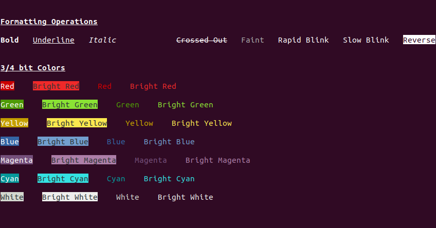

#   


# Chalk

Chalk is an expressive modern C++ (17 and above) Terminal text styling API with 3/4-bit color support.

## Features

- Nested styling
- Nested formatting
- CMake integration

## Installation

* Manual: It's an header only library, Clone this repo and copy chalk.h into your projects include directory
* CMake: ```FetchContent(chalk GIT_REPOSITORY <repo>); FetchContent_MakeAvailable(chalk); target_link_libraries(chalk::chalk)```

## Examples

TBD




## Supported Formatting Operations

- Bold
- Underline
- Italic
- Conceal
- Crossed Out
- Faint
- Rapid Blink
- Slow Blink
- Reverse


## Supported Colors (Background & Foreground)

- black
- red
- yellow
- green
- blue 
- magenta
- cyan
- white
- bright black
- bright red
- bright yellow
- bright green
- bright blue 
- bright magenta
- bright cyan
- bright white


## License

TBD
